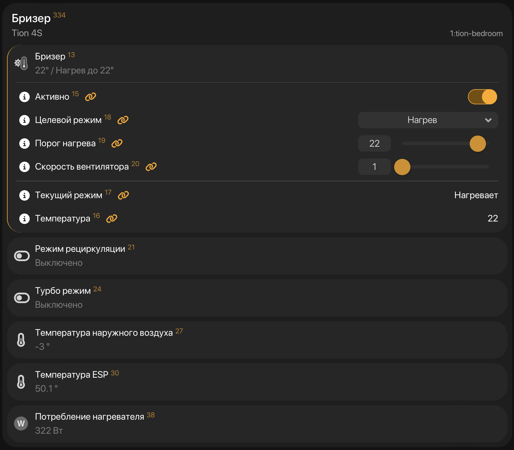
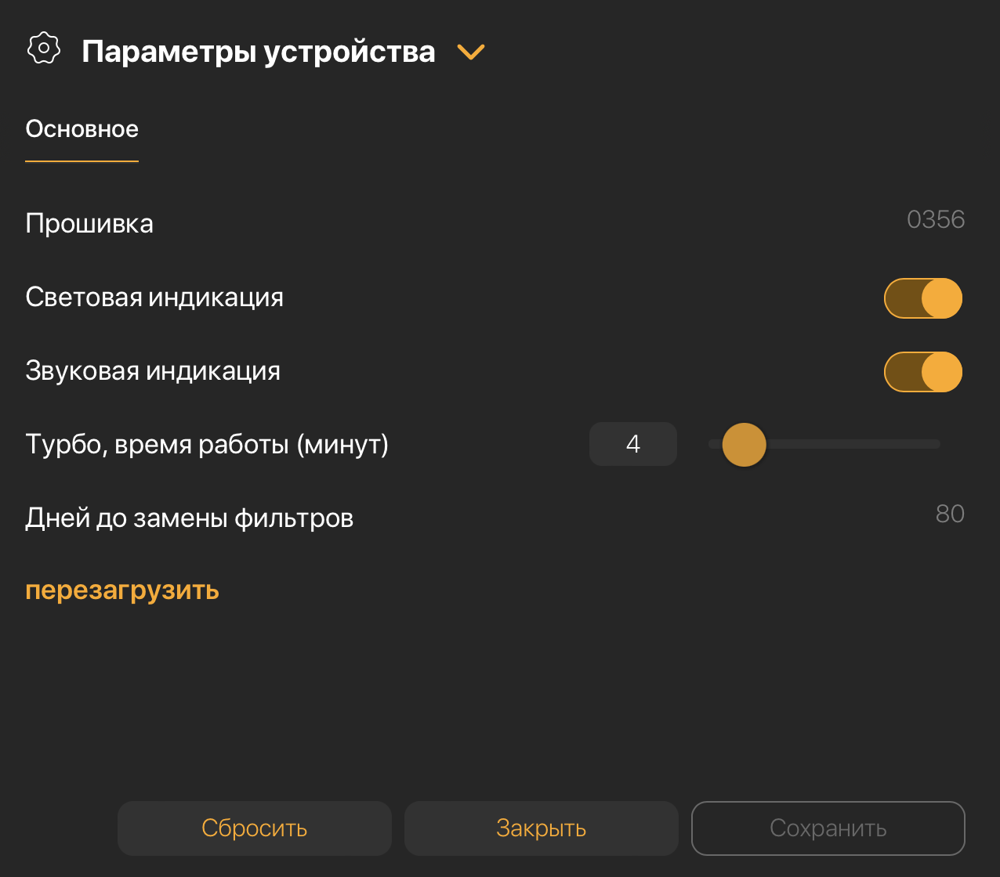
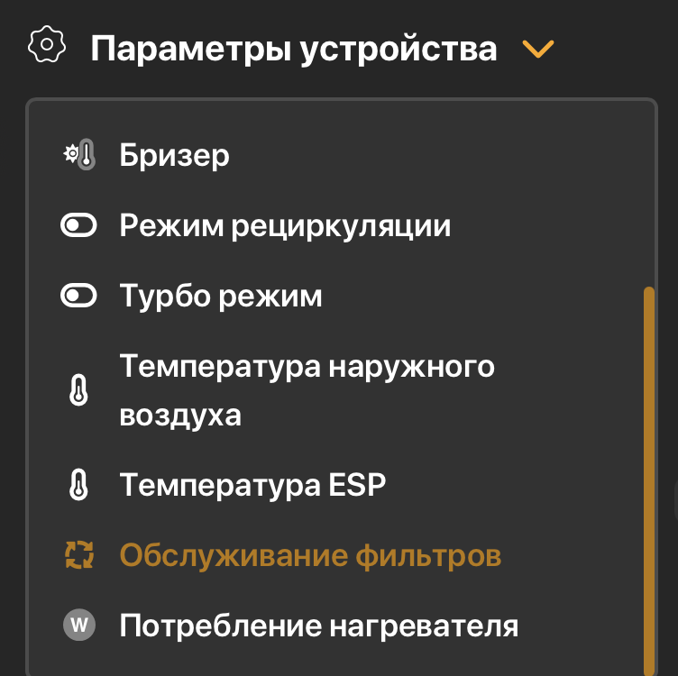
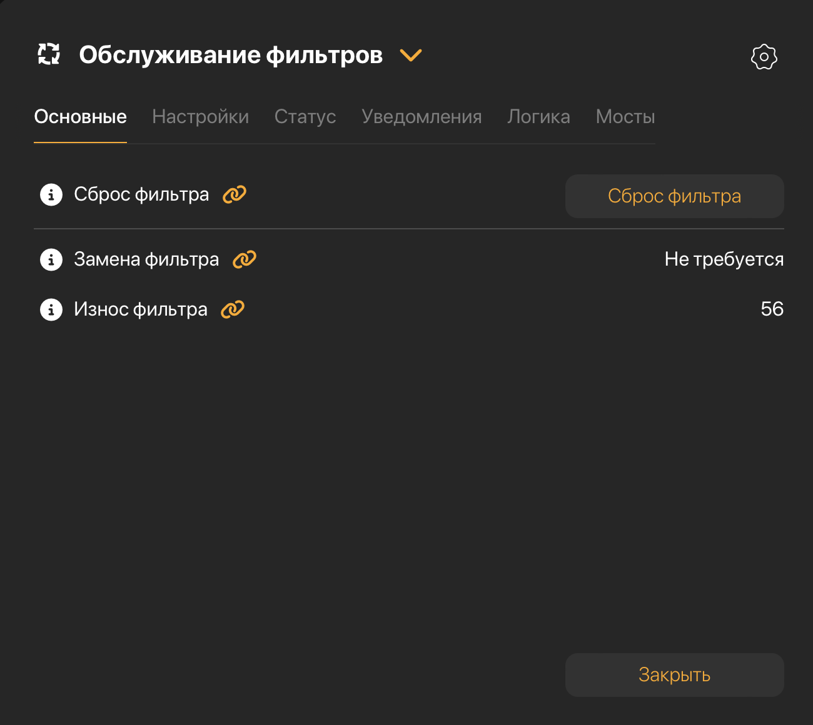

# sprut-tion
Tion 3s/4s breezer MQTT template for spruthub

Шаблон для spruthub, используется для связи [esphome-tion](https://github.com/dentra/esphome-tion) со [spruthub](https://spruthub.ru)

* **tion-esp.json** базовый шаблон, возможности:
  - термостат: включение/выключение
  - термостат: режимы нагрев/охлаждение
  - термостат: задать целевую температуру (порог нагрева)
  - термостат: задать скорость вентилятора от 1 до 6
  - термостат: отображение температуры и текущего режима
  - включение/выключение рециркуляции воздуха в помещении (отключение забора воздуха снаружи)
  - турбо режим (проветривание, в настройках можно задать время в минутах), бризер на заданное кол-во минут переходит в режим забора воздуха снаружи, охлаждения и включает 6 скорость, по истечении времени восстанавливает предыдущие настройки
  - отображение температуры наружного воздуха
  - отображение потребления нагревателя
  - настройки: отображение версии прошивки бризера
  - настройки: включение/выключение звуковой индикации
  - настройки: включение/выключение световой индикации
  - настройки: возможность задать время работы турбо режима от 1 от 20 минут
  - настройки: отображение времени, оставшегося до замены фильтров
  - настройки: кнопка для перезагрузки ESP
  - параметры устройства: обслуживание фильтров - возможность сбросить интервал замены фильтров в бризере
* **tion-esp-esptemp.json** шаблон с температурой ESP
  - дополнительно отображается температура ESP, в конфиге к esphome-tion нужно раскомментировать строку
    ```yaml
    # - packages/esp32_temperature.yaml
    ```







